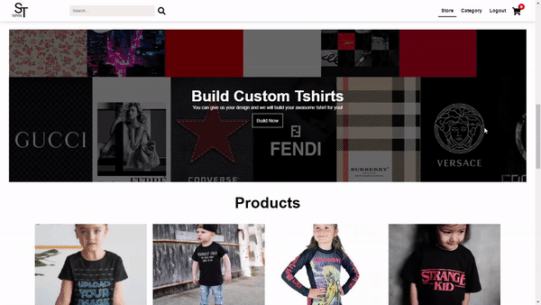
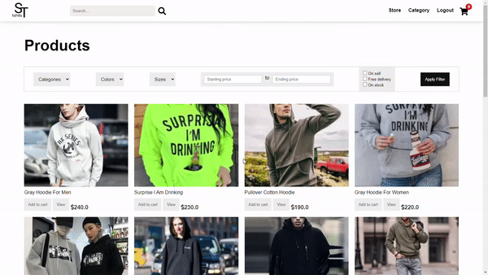

# Tshirt-eCommerce-Django
An application for online Tshirt shop. 
### Home page:

### Order custom tshirt:

### Product Filtering

### Cart

## Features:
#### 1. authentication.
#### 2. add product to your cart without login by using cookies.
#### 3. order custom Tshirt.
#### 4. customizable cart.
#### 5. admin can add, delete and update products.
#### 6. Rating and reviewing products.
#### 7. Search products and see products based on category.
#### 8. product filtering.

super user: Tshirt