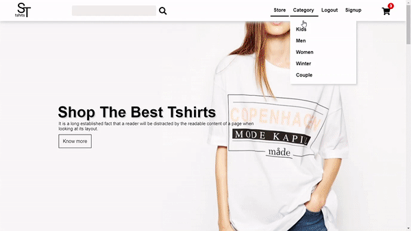

# Tshirt-eCommerce-Django
#### This site is a prototype of online Tshirt shop. 
## Features:
#### 1. Login and signup.
#### 2. add product to your cart without login by using cookies.
#### 3. customizable cart.
#### 4. admin can add, delete and update products.
#### 5. Search products and see products based on category.

## Home page:

## Front-end Features:
#### 1. parallax effect.
#### 2. JavaScript fatch API for smooth experience.
#### 3. Core html, css, js.

## Product:

## Back-end features:
#### 1. Django
#### 2. JSON
#### 3. SQLite3 database
